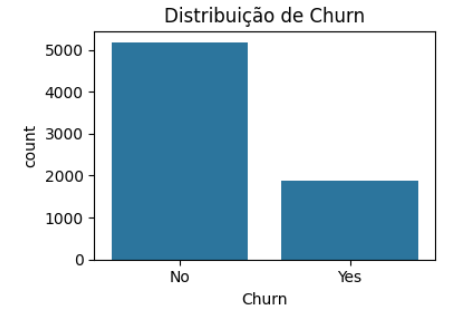
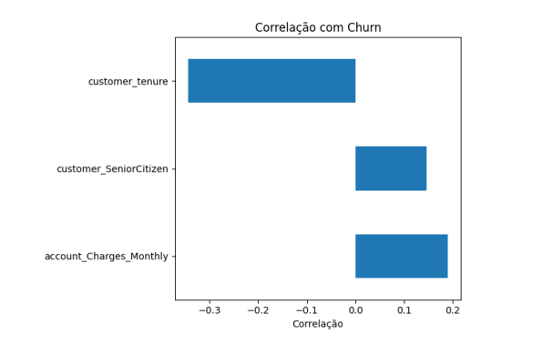
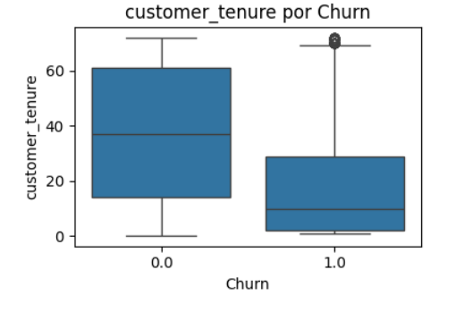
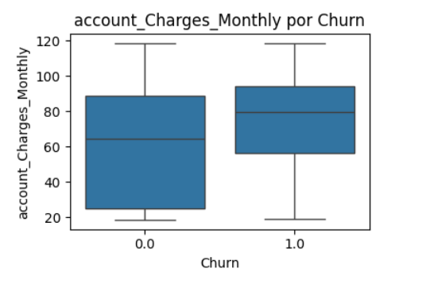
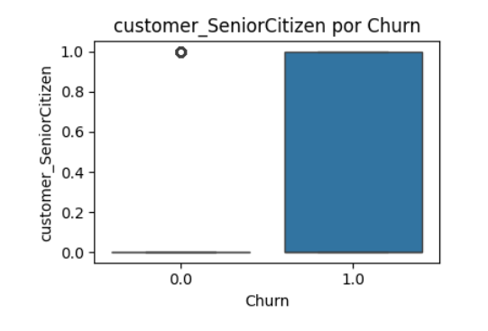

# telecomx_1
Link da API:
https://github.com/ingridcristh/challenge2-data-science/blob/main/TelecomX_Data.json
https://github.com/ingridcristh/challenge2-data-science/tree/main




Motivos do churn segundo as variáveis apresentadas:
Tempo de cliente (customer_tenure):



Clientes que saíram (Churn = Yes) têm em média menor tempo de permanência (aprox. 18 meses) comparado aos que ficaram (aprox. 38 meses).



Correlação negativa moderada (-0.34) indica que quanto menor o tempo de cliente, maior a chance de churn.

Ou seja, clientes novos tendem a sair mais rápido.


Valor da cobrança mensal (account_Charges_Monthly):



Clientes que saíram pagam em média mais caro por mês (74,44) que os que ficaram (61,27).

Correlação positiva (0.19) sugere que clientes com cobranças mensais mais altas têm maior probabilidade de cancelar.

Isso pode indicar insatisfação com custo-benefício, levando à saída.

Idade (indicador customer_SeniorCitizen):



Clientes que saíram têm maior proporção de idosos (25%) do que os que ficaram (13%).

Correlação positiva (0.15) mostra que clientes idosos têm uma leve tendência a churn maior.

Talvez por necessidades diferentes ou menos engajamento com os serviços.

Resumo final
O churn está acontecendo principalmente porque:

Clientes novos (baixo tempo de contrato) têm maior risco de sair; talvez por falta de fidelização ou adaptação ao serviço.

Clientes que pagam mensalidades mais altas parecem mais propensos a cancelar, sugerindo que preço ou percepção de valor podem ser um problema.

Clientes idosos também apresentam maior tendência a cancelar, o que pode requerer atenção específica no atendimento ou oferta de serviços.

Recomendações iniciais
Investir em programas de fidelização e onboarding para clientes novos.

Revisar estratégias de preço ou pacotes para clientes com cobranças altas.

Oferecer suporte personalizado para clientes idosos.


Analises;

Colunas numéricas: ['customer_SeniorCitizen', 'customer_tenure', 'account_Charges_Monthly']
🔤 Colunas categóricas: ['customerID', 'customer_gender', 'customer_Partner', 'customer_Dependents', 'phone_PhoneService', 'phone_MultipleLines', 'internet_InternetService', 'internet_OnlineSecurity', 'internet_OnlineBackup', 'internet_DeviceProtection', 'internet_TechSupport', 'internet_StreamingTV', 'internet_StreamingMovies', 'account_Contract', 'account_PaperlessBilling', 'account_PaymentMethod', 'account_Charges_Total']

📊 Distribuição da variável 'Churn':
Churn
No     0.73463
Yes    0.26537
Name: proportion, dtype: float64

📈 Estatísticas das variáveis numéricas por 'Churn':
       customer_SeniorCitizen  customer_tenure  account_Charges_Monthly
Churn                                                                  
No                   0.128721        37.569965                61.265124
Yes                  0.254682        17.979133                74.441332

🔗 Correlação com 'Churn':
Churn                      1.000000
account_Charges_Monthly    0.189866
customer_SeniorCitizen     0.146733
customer_tenure           -0.344079


## TelecomX - Pipeline de Extração e Carga (ETL)

Este projeto realiza a extração do dataset TelecomX em JSON, normaliza os dados (flatten) em colunas tabulares e carrega no SQLite para análises.

### Estrutura do Projeto
- `api/TelecomX_Data.json`: fonte de dados em JSON (ou `api/TelecomX_data.json`).
- `api/extraction.py`: inspeção e exploração do JSON (dimensões, tipos, preview, chaves aninhadas).
- `api/data_base_load.py`: normalização (flatten) e carga dos dados para SQLite.
- `api/TelecomX_dicionario.md`: dicionário de dados (se aplicável).

### Pré-requisitos
- Python 3.10+
- Pip

### Ambiente Virtual (recomendado)
```bash
python3 -m venv .venv
source .venv/bin/activate
pip install pandas
```

### Execução
1) Inspecionar dados (opcional):
```bash
python api/extraction.py
```

2) Normalizar e carregar em SQLite:
```bash
python api/data_base_load.py
```

Saída esperada na execução de carga:
- Preview do DataFrame (head)
- Dimensões e lista de colunas
- Banco gerado em `api/telecomx.db` com a tabela `telecomx_dados`

### Como funciona a normalização (flatten)
A partir de um registro exemplo:
```json
{
  "customerID": "9812-GHVRI",
  "Churn": "No",
  "customer": {"gender": "Female", "SeniorCitizen": 0, "Partner": "No", "Dependents": "No", "tenure": 40},
  "phone": {"PhoneService": "Yes", "MultipleLines": "Yes"},
  "internet": {"InternetService": "Fiber optic", "OnlineSecurity": "No", "OnlineBackup": "No", "DeviceProtection": "No", "TechSupport": "No", "StreamingTV": "No", "StreamingMovies": "Yes"},
  "account": {"Contract": "Month-to-month", "PaperlessBilling": "No", "PaymentMethod": "Bank transfer (automatic)", "Charges": {"Monthly": 83.85, "Total": "3532.25"}}
}
```
O processo gera colunas como:
- `customerID`, `Churn`
- `customer.gender`, `customer.SeniorCitizen`, `customer.Partner`, `customer.Dependents`, `customer.tenure`
- `phone.PhoneService`, `phone.MultipleLines`
- `internet.InternetService`, `internet.OnlineSecurity`, `internet.OnlineBackup`, `internet.DeviceProtection`, `internet.TechSupport`, `internet.StreamingTV`, `internet.StreamingMovies`
- `account.Contract`, `account.PaperlessBilling`, `account.PaymentMethod`, `account.Charges.Monthly`, `account.Charges.Total`

### Banco de Dados
- Caminho: `api/telecomx.db`
- Tabela: `telecomx_dados`
- Tipos: colunas criadas como `TEXT` por simplicidade; números são armazenados como texto. Se desejar tipagem numérica, adapte a criação de tabela e conversões.

Exemplo de consulta rápida:
```python
import sqlite3
conn = sqlite3.connect('api/telecomx.db')
cur = conn.cursor()
cur.execute('SELECT COUNT(*) FROM telecomx_dados')
print('Linhas:', cur.fetchone()[0])
conn.close()
```

### Solução de Problemas
- Erro ao instalar pacotes (PEP 668): use ambiente virtual (`python3 -m venv .venv`).
- JSON não encontrado: verifique nomes `TelecomX_Data.json` vs `TelecomX_data.json` e pasta `api/`.
- Colunas ausentes: execute novamente a carga com a opção padrão que recria a tabela.

### Licença
Uso educacional/demonstrativo. Ajuste conforme necessário.
